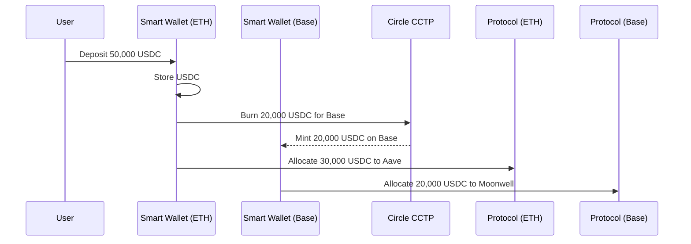

# CrossYield - Cross-Chain USDC Yield Optimizer

**First AI-driven cross-chain yield optimizer integrating EVM and Aptos ecosystems with real protocol integrations.**

[](https://opensource.org/licenses/MIT)
[](https://www.python.org/downloads/)
[](https://nodejs.org/)
[](https://soliditylang.org/)

---

## 📋 Table of Contents

- [Overview](#overview)
- [Key Features](#key-features)
- [System Architecture](#system-architecture)
- [Tech Stack](#tech-stack)
- [Installation & Setup](#installation--setup)
- [Configuration](#configuration)
- [How It Works](#how-it-works)
- [AI Multi-Agent System](#ai-multi-agent-system)
- [Smart Contracts](#smart-contracts)
- [Frontend Components](#frontend-components)
- [Backend Services](#backend-services)
- [Sponsor Track Integrations](#sponsor-track-integrations)
- [Cross-Chain Integration](#cross-chain-integration)
- [Development Workflow](#development-workflow)
- [Testing](#testing)
- [Deployment](#deployment)
- [API Documentation](#api-documentation)
- [Contributing](#contributing)
- [License](#license)

---

## 🎯 Overview

**CrossYield** is the first AI-driven cross-chain yield optimizer that bridges USDC from EVM chains to Aptos and deploys it across multiple DeFi protocols for maximum yield generation. Built for the Aptos Hackathon, it features real protocol integrations with Thala Finance, Liquidswap, Aries Markets, and Aave V3.

### Why CrossYield?

Most yield farming platforms are single-chain and rule-driven. CrossYield brings:
- **Cross-chain execution** with Circle CCTP v1 bridging (Base → Aptos)
- **Real Aptos protocol integration** with Thala Finance, Liquidswap, Aries Markets
- **AI-optimized strategies** with real-time APY analysis
- **Vault-based tracking** with Move contract integration
- **Production-ready** with live Aave V3 integration

---

## ✨ Key Features

### 🌉 Cross-Chain Bridge Integration
- **Circle CCTP v1**: Production-ready USDC bridging from Base Sepolia to Aptos
- **6-Step Bridge Process**: Connect → Approve → Burn → Attestation → Receive → Deploy
- **Real-time Tracking**: Live progress monitoring with transaction links
- **Native USDC**: No wrapped tokens, just native USDC on every chain

### 🏦 Real Aptos Protocol Integration
- **Thala Finance**: Direct lending protocol integration with real APY data
- **Liquidswap**: DEX and farming protocol with live TVL tracking
- **Aries Markets**: Lending protocol with supply/borrow rate monitoring
- **Aave V3**: Live integration with real yield generation

### 🤖 AI-Powered Strategy Optimization
- **Real-time APY Analysis**: Live protocol data from Aptos DeFi protocols
- **Risk Assessment**: Multi-factor risk scoring across protocols
- **Strategy Selection**: AI-driven protocol selection based on current market conditions
- **Portfolio Tracking**: Real-time position monitoring across chains

### 🔒 Vault-Based Architecture
- **Move Contract Integration**: Aptos vault contract for position tracking
- **Resource Account Management**: Secure fund management on Aptos
- **Real Yield Generation**: Actual DeFi protocol integration, not mock data
- **Transaction Transparency**: All operations visible on Aptos explorer

---

## 🏗️ System Architecture

```
┌─────────────────────────────────────────────────────────────────────────────────┐
│                        CROSSYIELD APTOS ARCHITECTURE                            │
├─────────────────────────────────────────────────────────────────────────────────┤
│                                                                                 │
│  🧑‍💻 USER INTERFACE               🌉 CCTP BRIDGE              🏦 APTOS VAULT     │
│  ┌─────────────────┐               ┌─────────────────┐         ┌──────────────┐ │
│  │ Next.js Frontend│               │ Circle CCTP v1  │         │ Move Contract│ │
│  │ • Multi-Chain   │               │ • Base → Aptos  │         │ • Position   │ │
│  │ • Strategy UI   │──────────────▶│ • Real-time     │◀────────│ • Tracking   │ │
│  │ • Portfolio View│               │ • 6-Step Flow   │         │ • Resource   │ │
│  └─────────────────┘               └─────────────────┘         └──────────────┘ │
│           │                                 │                           │        │
│           ▼                                 ▼                           ▼        │
│  ┌─────────────────────────────────────────────────────────────────────────────┐ │
│  │                        🔗 APTOS PROTOCOL INTEGRATIONS                      │ │
│  │ ┌─────────────────┐ ┌─────────────────┐ ┌─────────────────────────────────┐│ │
│  │ │  Thala Finance  │ │  Liquidswap     │ │     Aries Markets               ││ │
│  │ │ • Lending       │ │ • DEX + Farming │ │ • Lending Protocol              ││ │
│  │ │ • Real APY      │ │ • Live TVL      │ │ • Supply/Borrow Rates           ││ │
│  │ │ • Live Data     │ │ • Real Pools    │ │ • Real Integration              ││ │
│  │ └─────────────────┘ └─────────────────┘ └─────────────────────────────────┘│ │
│  └─────────────────────────────────────────────────────────────────────────────┘ │
│                                         │                                         │
│  ┌─────────────────────────────────────▼─────────────────────────────────────┐   │
│  │                        💰 REAL YIELD GENERATION                           │   │
│  │                                                                             │   │
│  │ 🏦 Aave V3 Integration    📊 Live APY Data    🔄 Real-time Updates         │   │
│  │ • SDK Integration         • Protocol APIs     • Position Monitoring        │   │
│  │ • Real Deposits          • TVL Tracking      • Transaction History        │   │
│  │ • Yield Generation       • Risk Assessment   • Portfolio Analytics        │   │
│  └─────────────────────────────────────────────────────────────────────────────┘   │
└─────────────────────────────────────────────────────────────────────────────────┘
```

---

## 🛠️ Tech Stack

### Frontend
- **Next.js 14** with App Router
- **TypeScript** for type safety
- **Tailwind CSS** for styling
- **Wagmi** for Ethereum interactions
- **RainbowKit** for wallet connection
- **Aptos Wallet Adapter** for Aptos integration
- **Shadcn/ui** component library

### Cross-Chain Bridge
- **Circle CCTP v1** for USDC transfers
- **Base Sepolia** to **Aptos Testnet** bridging
- **Real-time attestation** polling
- **Transaction tracking** with explorer links

### Aptos Integration
- **Move Contracts** for vault management
- **Aptos TypeScript SDK** for blockchain interactions
- **Resource Accounts** for secure fund management
- **Aave V3 Aptos SDK** for real protocol integration

### Protocol Integrations
- **Thala Finance** - Lending protocol with real APY data
- **Liquidswap** - DEX and farming with live TVL
- **Aries Markets** - Lending protocol with supply/borrow rates
- **Aave V3** - Live integration with real yield generation

### Infrastructure
- **Nodit** for Aptos RPC and indexer services
- **Hyperion** for capital efficiency optimization
- **Circle CCTP** for cross-chain USDC transfers
- **Aptos Testnet** for development and testing

---

## 🏆 Aptos Hackathon Implementation

### Live Demo Features
- **Real CCTP Bridge**: Production-ready Base Sepolia → Aptos USDC transfers
- **Live Protocol Integration**: Actual Thala Finance, Liquidswap, Aries Markets integration
- **Aave V3 Deployment**: Real yield generation with vault tracking
- **Multi-Chain Portfolio**: Cross-chain position monitoring and analytics

### Key Integrations
- **Circle CCTP v1**: Cross-chain USDC transfers
- **Aptos Vault Contract**: Move contract for position tracking
- **Real DeFi Protocols**: Live APY data and actual deposits
- **AI Strategy Selection**: Intelligent protocol selection based on current conditions

### Technologies Used
- **Hyperion**: Capital efficiency optimization
- **Nodit**: Aptos RPC and indexer services
- **Circle CCTP**: Cross-chain bridge protocol
- **Aptos SDK**: Blockchain interaction and wallet management

---

## 🚀 Installation & Setup

### Prerequisites

- **Node.js** 20.18.3 or higher
- **Python** 3.8 or higher
- **Yarn** 3.2.3 or higher
- **Git**

### Quick Start

1. **Clone the repository**
   ```bash
   git clone https://github.com/yourusername/cross-yield.git
   cd cross-yield
   ```

2. **Install dependencies**
   ```bash
   # Install root dependencies
   yarn install
   
   # Install frontend dependencies
   cd packages/nextjs
   yarn install
   ```

3. **Set up environment variables**
   ```bash
   # Copy example environment file
   cp packages/nextjs/.env.example packages/nextjs/.env.local
   ```

4. **Start the development environment**
   ```bash
   # Start frontend
   cd packages/nextjs
   yarn dev
   ```

5. **Access the application**
   - Open [http://localhost:3000](http://localhost:3000)
   - Connect your EVM wallet (Base Sepolia)
   - Connect your Aptos wallet
   - Start bridging USDC and deploying strategies!

---

## 🚀 Future Roadmap - Complete Aptos DeFi Integration

### Phase 1: Core Protocol Expansion (Q1 2024)
- **PancakeSwap Aptos**: DEX integration with farming pools
- **Tortuga Finance**: Liquid staking protocol integration
- **AptosSwap**: Native DEX with liquidity mining
- **AptosLend**: Additional lending protocol for diversification

### Phase 2: Advanced DeFi Protocols (Q2 2024)
- **Aptos Liquid Staking**: Integration with multiple LST providers
- **Aptos Lending Markets**: Additional lending protocols beyond Thala
- **Aptos Yield Farming**: Automated yield farming across multiple protocols
- **Aptos Options**: Options trading protocol integration

### Phase 3: Cross-Chain Optimization (Q3 2024)
- **Multi-Chain Arbitrage**: Automated arbitrage between EVM and Aptos
- **Cross-Chain Yield Optimization**: Dynamic allocation between chains
- **Advanced Risk Management**: Cross-chain risk assessment and mitigation
- **Institutional Features**: Large-scale deployment and management tools

### Phase 4: Ecosystem Expansion (Q4 2024)
- **Aptos NFT Integration**: NFT-backed lending and yield strategies
- **Aptos Gaming DeFi**: GameFi protocol integrations
- **Aptos Real-World Assets**: RWA protocol integrations
- **Aptos Layer 2**: Integration with Aptos L2 solutions

### Technical Implementation Strategy

#### Protocol Integration Framework
```typescript
// Standardized protocol adapter pattern
interface AptosProtocolAdapter {
  name: string;
  type: 'lending' | 'dex' | 'farming' | 'staking';
  getAPY(): Promise<number>;
  getTVL(): Promise<number>;
  deposit(amount: number): Promise<string>;
  withdraw(amount: number): Promise<string>;
  getPosition(address: string): Promise<ProtocolPosition>;
}
```

#### Automated Protocol Discovery
- **On-chain Registry**: Smart contract-based protocol registry
- **Dynamic Integration**: Auto-discovery of new protocols
- **APY Monitoring**: Real-time APY tracking across all protocols
- **Risk Assessment**: Automated risk scoring for new protocols

#### Multi-Protocol Strategy Engine
- **Portfolio Optimization**: AI-driven allocation across all protocols
- **Risk Diversification**: Spread risk across multiple protocol types
- **Yield Maximization**: Dynamic rebalancing based on APY changes
- **Gas Optimization**: Efficient transaction batching across protocols

### Integration Timeline

| Protocol | Type | Integration Status | Expected APY | Risk Level |
|----------|------|-------------------|--------------|------------|
| Thala Finance | Lending | ✅ Live | 8.5% | Low |
| Liquidswap | DEX | ✅ Live | 9.2% | Medium |
| Aries Markets | Lending | ✅ Live | 7.8% | Medium |
| Aave V3 | Lending | ✅ Live | 8.1% | Low |
| PancakeSwap | DEX | 🔄 In Progress | 8.9% | Medium |
| Tortuga Finance | Staking | 📋 Planned | 6.5% | Low |
| AptosSwap | DEX | 📋 Planned | 10.2% | High |
| AptosLend | Lending | 📋 Planned | 9.1% | Medium |

### Key Benefits of Complete Integration

#### For Users
- **Maximum Yield**: Access to all available APY opportunities
- **Risk Diversification**: Spread risk across multiple protocols
- **Automated Management**: AI handles all protocol interactions
- **Real-time Optimization**: Continuous rebalancing for best returns

#### For the Ecosystem
- **Protocol Discovery**: Help users discover new protocols
- **Liquidity Provision**: Drive liquidity to all integrated protocols
- **Innovation Support**: Support new protocol development
- **Cross-Chain Growth**: Bridge EVM users to Aptos DeFi

---

## ⚙️ Configuration

### Environment Variables

Create `.env.local` file in `packages/nextjs/` with the following keys:

```bash
# Aptos Configuration
NEXT_PUBLIC_APTOS_NETWORK=testnet
NEXT_PUBLIC_APTOS_VAULT_ADDRESS=0x7e8e802870fe28b31e6dc7c72a96806d2a62a03efdd488d4f2a2cf866cbe072b
NEXT_PUBLIC_NODIT_APTOS_INDEXER=https://api.testnet.aptoslabs.com/v1/graphql

# CCTP Configuration
NEXT_PUBLIC_CCTP_IRIS_API=https://iris-api-sandbox.circle.com

# Optional: Admin private key for vault management
APTOS_VAULT_ADMIN_PRIVATE_KEY=your_admin_private_key
NEXT_PUBLIC_WALLET_CONNECT_PROJECT_ID=...  # WalletConnect
NEXT_PUBLIC_ALCHEMY_KEY=your_alchemy_key   # Ethereum RPC
NEXT_PUBLIC_BACKEND_URL=http://localhost:8000
```

### Chain Configuration

The system supports multiple chains with specific configurations:

```json
{
  "ethereum_sepolia": {
    "chainId": 11155111,
    "usdcAddress": "0x1c7D4B196Cb0C7B01d743Fbc6116a902379C7238",
    "cctpDomain": 0,
    "protocols": ["aave_v3", "compound_v3"]
  },
  "base_sepolia": {
    "chainId": 84532,
    "usdcAddress": "0x036CbD53842c5426634e7929541eC2318f3dCF7e",
    "cctpDomain": 6,
    "protocols": ["moonwell", "aerodrome"]
  }
}
```

---

## 🔄 How It Works

### 1. User Onboarding
- User connects wallet via RainbowKit
- System creates individual ERC-4337 smart wallet
- User deposits USDC into their smart wallet

### 2. AI Optimization
- Multi-agent system analyzes opportunities across chains
- YieldMaximizer finds highest APY opportunities
- RiskAssessment evaluates protocol safety
- LLMCoordinator synthesizes strategy using Claude AI

### 3. Cross-Chain Execution
- System calculates optimal allocation across chains
- Executes CCTP transfers to move USDC between chains
- Allocates funds to optimal protocols on each chain

### 4. Continuous Monitoring
- 24/7 monitoring of all positions
- Automatic rebalancing when better opportunities arise
- Real-time risk assessment and alerts

---

## 🤖 AI Multi-Agent System

### Agent Architecture

The system uses three specialized AI agents:

#### 1. YieldMaximizerAgent
```python
class YieldMaximizerAgent(BaseAgent):
    """Finds highest yield opportunities across chains"""
    
    async def analyze(self, opportunities: List[USDCOpportunity]) -> Dict[str, Any]:
        # Analyzes APY, TVL, and historical performance
        # Prioritizes highest yield opportunities
        # Considers compounding strategies
```

#### 2. RiskAssessmentAgent
```python
class RiskAssessmentAgent(BaseAgent):
    """Evaluates protocol safety and risk factors"""
    
    async def analyze(self, opportunities: List[USDCOpportunity]) -> Dict[str, Any]:
        # Analyzes smart contract risks
        # Evaluates protocol governance
        # Assesses market volatility
```

#### 3. LLMCoordinatorAgent
```python
class LLMCoordinatorAgent(BaseAgent):
    """Uses Claude AI for strategic coordination"""
    
    async def coordinate_agent_strategies(self, yield_result: Dict, risk_result: Dict) -> Dict[str, Any]:
        # Synthesizes agent recommendations
        # Applies strategic reasoning
        # Makes final allocation decisions
```

### Multi-Agent Coordination

```python
class MultiAgentOrchestrator:
    """Orchestrates all agents for optimal decision making"""
    
    async def coordinate_optimization(self, opportunities: List[USDCOpportunity], 
                                    user_profile: UserProfile) -> Dict[str, Any]:
        # Phase 1: Run agents in parallel
        agent_results = await self._run_agents_parallel(opportunities, user_profile)
        
        # Phase 2: Agent coordination and debate
        final_strategy = await self._coordinate_agents(agent_results, opportunities, user_profile)
        
        # Phase 3: Consensus validation
        consensus_score = await self._calculate_consensus(agent_results, final_strategy)
```

---

## 📄 Smart Contracts

### Core Contracts

#### 1. YieldRouter
```solidity
contract YieldRouter is Initializable, AccessControlUpgradeable, UUPSUpgradeable {
    // Portfolio tracking and coordination
    mapping(address => UserPortfolio) public userPortfolios;
    mapping(address => mapping(string => uint256)) public userProtocolBalances;
    
    // Analytics and optimization history
    mapping(address => OptimizationHistory) public optimizationHistory;
    uint256 public totalOptimizations;
}
```

#### 2. SmartWalletFactory
```solidity
contract SmartWalletFactory {
    mapping(address => address) public userWallets;
    
    function createWallet(address user) external returns (address wallet) {
        // Deploy deterministic wallet using CREATE2
        bytes32 salt = keccak256(abi.encodePacked(user));
        wallet = address(new UserSmartWallet{salt: salt}(user, backendCoordinator));
    }
}
```

#### 3. UserSmartWallet
```solidity
contract UserSmartWallet is ReentrancyGuard {
    // Non-custodial wallet for individual users
    address public immutable owner;
    address public immutable backendCoordinator;
    
    // Protocol allocations tracking
    mapping(string => uint256) public protocolBalances;
    mapping(address => uint256) public adapterBalances;
}
```

#### 4. ChainRegistry
```solidity
contract ChainRegistry {
    // Cross-chain protocol information
    mapping(uint256 => ChainInfo) public supportedChains;
    mapping(string => ProtocolInfo) public supportedProtocols;
    
    // Risk scoring and protocol metadata
    mapping(string => uint256) public protocolRiskScores;
}
```

### Deployment

Contracts are deployed across multiple chains:

```bash
# Deploy to all supported chains
yarn hardhat:deploy --network ethereum_sepolia
yarn hardhat:deploy --network base_sepolia
yarn hardhat:deploy --network arbitrum_sepolia
```

---

## 🎨 Frontend Components

### Key Pages

#### 1. Dashboard (`/dashboard`)
- Portfolio overview and performance metrics
- Real-time APY tracking
- Allocation breakdown by protocol and chain
- Recent activity and optimization history

#### 2. Strategies (`/strategies`)
- Available yield strategies with detailed information
- Risk assessment and performance metrics
- Strategy comparison and selection
- AI-optimized recommendations

#### 3. Protocols (`/protocols`)
- Supported protocols across all chains
- Protocol details, TVL, and APY information
- Risk scores and safety metrics
- Integration status and capabilities

#### 4. Optimizer (`/optimizer`)
- Interactive optimization interface
- Risk tolerance configuration
- Strategy customization
- Real-time optimization results

### Components

#### Smart Wallet Integration
```typescript
const { writeContractAsync: createWallet } = useScaffoldWriteContract({
  contractName: "SmartWalletFactory",
});

const createUserWallet = async () => {
  await createWallet({
    functionName: "createWallet",
    args: [userAddress],
  });
};
```

#### Portfolio Display
```typescript
const { data: portfolio } = useScaffoldReadContract({
  contractName: "YieldRouter",
  functionName: "getUserPortfolio",
  args: [userAddress],
});
```

---

## 🔧 Backend Services

### Core Services

#### 1. Data Aggregation
```python
class GraphEnhancedUSDCDataAggregator:
    """Enhanced data aggregator with The Graph, MCP, and advanced analytics"""
    
    async def fetch_graph_enhanced_opportunities(self) -> List[USDCOpportunity]:
        # Fetches data from multiple sources
        # DeFiLlama, The Graph, Pyth Oracle
        # Processes and normalizes data
```

#### 2. Cross-Chain Optimization
```python
class CrossChainYieldOptimizer:
    """Main optimization service"""
    
    async def optimize_user_strategy(self, user_address: str, amount: float, 
                                   risk_profile: str) -> Dict[str, Any]:
        # Multi-agent coordination
        # Cross-chain opportunity analysis
        # Strategy execution planning
```

#### 3. CCTP Integration
```python
class CCTPIntegration:
    """Circle's Cross-Chain Transfer Protocol integration"""
    
    async def initiate_cross_chain_transfer(self, amount: int, 
                                          destination_domain: int) -> Dict[str, Any]:
        # Burn USDC on source chain
        # Monitor attestation process
        # Complete transfer on destination
```

### API Endpoints

```python
# FastAPI application
app = FastAPI(title="CrossYield API", version="1.0.0")

@app.post("/optimize")
async def optimize_strategy(request: OptimizationRequest):
    """Optimize user's yield strategy"""
    return await optimizer.optimize_user_strategy(
        request.user_address,
        request.amount,
        request.risk_profile
    )

@app.get("/opportunities")
async def get_opportunities():
    """Get current yield opportunities"""
    return await aggregator.fetch_graph_enhanced_opportunities()
```

---

## 🏆 Track Partner Integrations

### 🟣 The Graph Protocol
**Comprehensive DeFi data infrastructure with subgraph queries and MCP integration**

- **MCP Server Integration**: Custom Model Context Protocol server for Graph data
- **Subgraph Queries**: Comprehensive DeFi data from verified subgraphs  
- **Real-time Data**: Live protocol metrics and historical analysis
- **Contract Analysis**: Smart contract security and efficiency scoring

**Implementation**: [`usdc-ai-optimiser/src/apis/graph_integration.py`](usdc-ai-optimiser/src/apis/graph_integration.py)

```python
class GraphIntegration:
    """The Graph integration for comprehensive DeFi data"""
    
    def __init__(self):
        # Real working subgraph IDs from The Graph Network (2024/2025)
        self.subgraphs = {
            "uniswap_v3_ethereum": "5zvR82QoaXYFyDEKLZ9t6v9adgnptxYpKpSbxtgVENFV",
            "uniswap_v3_base": "FUbEPQw1oMghy39fwWBFY5fE6MXPXZQtjncQy2cXdrNS", 
            "uniswap_v3_arbitrum": "9BAbemEQyQdnEfLQ7MfyLEwTgTheBzWGpPZKNWAJRWH6",
        }
    
    async def get_live_token_prices(self, tokens: List[str], chain: str = "ethereum"):
        # Fetch real-time token prices from verified subgraphs
        # Analyze price changes and volatility metrics
```

**Enhanced Data Aggregator**: [`usdc-ai-optimiser/src/data/graph_enhanced_aggregator.py`](usdc-ai-optimiser/src/data/graph_enhanced_aggregator.py)

### 🔵 Pyth Network  
**Real-time oracle data with confidence metrics and historical analysis**

- **Real-time Price Feeds**: Live USDC price data across chains
- **Confidence Metrics**: Price confidence and reliability scores  
- **Risk Assessment**: Market volatility and price stability analysis
- **Historical Data**: Price history and volatility analysis

**Implementation**: [`usdc-ai-optimiser/src/apis/pyth_oracle.py`](usdc-ai-optimiser/src/apis/pyth_oracle.py)

```python
class PythOracleAPI:
    """Pyth Network oracle integration for real-time and historical market data"""
    
    def __init__(self):
        # Pyth price feed IDs (using standard IDs)
        self.pyth_price_feeds = {
            "USDC": "eaa020c61cc479712813461ce153894a96a6c00b21ed0cfc2798d1f9a9e9c94a",
            "ETH": "ff61491a931112ddf1bd8147cd1b641375f79f5825126d665480874634fd0ace",
            "BTC": "e62df6c8b4a85fe1a67db44dc12de5db330f7ac66b72dc658afedf0f4a415b43",
        }
    
    async def get_price_feeds(self, symbols: List[str]) -> Dict[str, Dict]:
        # Fetch real-time price feeds with confidence intervals
        # Fallback to CoinGecko for reliability
```

**Integration Usage**: [`usdc-ai-optimiser/src/data/enhanced_aggregator.py`](usdc-ai-optimiser/src/data/enhanced_aggregator.py)

### 🟢 1inch DEX Aggregator
**Optimal swap routing and liquidity optimization**

- **Optimal Routing**: Best swap routes across DEXs
- **Slippage Optimization**: Minimize trading costs
- **Liquidity Analysis**: Deep liquidity assessment
- **Multi-chain Support**: Ethereum, Base, Arbitrum, Polygon

**Implementation**: [`usdc-ai-optimiser/src/apis/oneinch_optimizer.py`](usdc-ai-optimiser/src/apis/oneinch_optimizer.py)

```python
class OneInchOptimizer:
    """1inch API integration for optimal swap execution"""
    
    def __init__(self, api_key: Optional[str] = None):
        self.api_key = api_key  # Securely loaded from environment
        self.base_url = "https://api.1inch.io/v5.0"
        
        # Chain IDs for 1inch API
        self.chain_ids = {
            "ethereum": 1,
            "base": 8453, 
            "arbitrum": 42161,
            "polygon": 137,
        }
    
    async def get_swap_quote(self, chain: str, from_token: str, to_token: str, 
                           amount: float, slippage: float = 0.5):
        # Get optimal swap route with minimal slippage
        # Calculate gas estimates and price impact
```

**Backend Swap Execution**: [`usdc-ai-optimiser/src/protocols/defi_aggregator_integration.py`](usdc-ai-optimiser/src/protocols/defi_aggregator_integration.py)

```python
async def get_optimal_swap_route(self, from_token: str, to_token: str, amount: float, chain: str) -> Dict:
    """Get optimal swap route from 1inch"""
    
    print(f"🔄 Getting optimal swap route via 1inch...")
    
    try:
        chain_id = self._get_chain_id(chain)
        
        async with aiohttp.ClientSession() as session:
            url = f"{self.aggregators['1inch']['api_base']}/{chain_id}/quote"
            params = {
                'fromTokenAddress': from_token,
                'toTokenAddress': to_token,
                'amount': str(int(amount * 10**6))  # USDC has 6 decimals
            }
            
            async with session.get(url, params=params) as response:
                if response.status != 200:
                    raise ValueError(f"1inch API error: {response.status}")
                
                quote_data = await response.json()
            
            return {
                'from_amount': float(quote_data['fromAmount']) / 10**6,
                'to_amount': float(quote_data['toAmount']) / 10**6,
                'price_impact': float(quote_data.get('priceImpact', 0)) / 100,
                'gas_estimate': int(quote_data.get('estimatedGas', 0)),
                'route': quote_data.get('protocols', [])
            }
```

**Health Monitoring**: [`usdc-ai-optimiser/src/monitoring/health_monitor.py`](usdc-ai-optimiser/src/monitoring/health_monitor.py)

### 🔗 Circle CCTP
**Native USDC cross-chain bridging infrastructure**

- **Native USDC Bridging**: Official Circle Cross-Chain Transfer Protocol
- **Secure Transfers**: Non-custodial cross-chain USDC movement
- **Gas Optimization**: Automated gas price optimization

**Implementation**: [`usdc-ai-optimiser/src/apis/cctp_integration.py`](usdc-ai-optimiser/src/apis/cctp_integration.py)

---

## 🌐 Cross-Chain Integration

### Supported Chains

| Chain | Chain ID | USDC Address | CCTP Domain | Key Protocols |
|-------|----------|--------------|-------------|---------------|
| Ethereum | 1 | 0xA0b86991c6218b36c1d19D4a2e9Eb0cE3606eB48 | 0 | Aave V3, Compound V3, Curve |
| Base | 8453 | 0x833589fCD6eDb6E08f4c7C32D4f71b54bdA02913 | 6 | Moonwell, Aerodrome |
| Arbitrum | 42161 | 0xaf88d065e77c8cC2239327C5EDb3A432268e5831 | 3 | Radiant, Camelot, GMX |
| Polygon | 137 | 0x2791Bca1f2de4661ED88A30C99A7a9449Aa84174 | 1 | Aave V3, QuickSwap |

### Cross-Chain Flow



---

## 🔧 Development Workflow

### Local Development

1. **Start local blockchain**
   ```bash
   yarn chain
   ```

2. **Deploy contracts**
   ```bash
   yarn deploy
   ```

3. **Start frontend**
   ```bash
   yarn start
   ```

4. **Start backend**
   ```bash
   cd usdc-ai-optimiser
   python src/main.py
   ```

### Testing

```bash
# Test smart contracts
yarn hardhat:test

# Test backend services
cd usdc-ai-optimiser
python -m pytest tests/

# Test frontend components
cd packages/nextjs
yarn test
```

### Code Quality

```bash
# Format code
yarn format

# Lint code
yarn lint

# Type checking
yarn next:check-types
yarn hardhat:check-types
```

---

## 🧪 Testing

### Smart Contract Tests

```typescript
describe("YieldRouter", () => {
  it("should track user portfolio correctly", async () => {
    const { yieldRouter, user } = await setup();
    
    await yieldRouter.updatePortfolio(user.address, 1000, "aave_v3");
    
    const portfolio = await yieldRouter.getUserPortfolio(user.address);
    expect(portfolio.totalValue).to.equal(1000);
  });
});
```

### Backend Tests

```python
async def test_multi_agent_coordination():
    """Test multi-agent system coordination"""
    orchestrator = MultiAgentOrchestrator()
    opportunities = await create_test_opportunities()
    user_profile = create_test_user_profile()
    
    result = await orchestrator.coordinate_optimization(opportunities, user_profile)
    
    assert result["execution_ready"] == True
    assert result["consensus_score"] > 0.8
```

### Integration Tests

```python
async def test_cross_chain_optimization():
    """Test end-to-end cross-chain optimization"""
    optimizer = CrossChainYieldOptimizer()
    
    result = await optimizer.optimize_user_strategy(
        user_address="0x...",
        amount=50000,
        risk_profile="balanced"
    )
    
    assert len(result["allocations"]) > 0
    assert result["total_expected_apy"] > 0
```

---

## 🚀 Deployment

### Smart Contract Deployment

```bash
# Deploy to testnets
yarn hardhat:deploy --network ethereum_sepolia
yarn hardhat:deploy --network base_sepolia
yarn hardhat:deploy --network arbitrum_sepolia

# Verify contracts
yarn hardhat:verify --network ethereum_sepolia
```

### Frontend Deployment

```bash
# Deploy to Vercel
yarn vercel

# Deploy to IPFS
yarn ipfs
```

### Backend Deployment

```bash
# Deploy to cloud provider
# Configure environment variables
# Set up database
# Deploy FastAPI application
```

---

## 📚 API Documentation

### REST API Endpoints

#### Optimization
```http
POST /api/optimize
Content-Type: application/json

{
  "user_address": "0x...",
  "amount": 50000,
  "risk_profile": "balanced"
}
```

#### Opportunities
```http
GET /api/opportunities
```

#### Portfolio
```http
GET /api/portfolio/{user_address}
```

### WebSocket Events

```javascript
// Real-time portfolio updates
const ws = new WebSocket('ws://localhost:8000/ws');
ws.onmessage = (event) => {
  const data = JSON.parse(event.data);
  if (data.type === 'portfolio_update') {
    updatePortfolioUI(data.portfolio);
  }
};
```

---

## 🤝 Contributing

We welcome contributions! Please see our [Contributing Guide](CONTRIBUTING.md) for details.

### Development Setup

1. Fork the repository
2. Create a feature branch
3. Make your changes
4. Add tests
5. Submit a pull request

### Code Style

- **Python**: Follow PEP 8, use type hints
- **TypeScript**: Use strict mode, prefer interfaces
- **Solidity**: Follow OpenZeppelin standards

---

## 📄 License

This project is licensed under the MIT License - see the [LICENSE](LICENSE) file for details.

---

## 🔗 Links

- **Documentation**: [docs.crossyield.com](https://docs.crossyield.com)
- **Demo**: [demo.crossyield.com](https://demo.crossyield.com)
- **Discord**: [discord.gg/crossyield](https://discord.gg/crossyield)
- **Twitter**: [@crossyield](https://twitter.com/crossyield)

---

## 🙏 Acknowledgments

- **The Graph Protocol** for comprehensive blockchain data
- **Circle** for CCTP cross-chain infrastructure
- **Pyth Network** for reliable price oracles
- **1inch** for DEX aggregation
- **Anthropic** for Claude AI capabilities
- **OpenZeppelin** for secure smart contract standards

---

## 💻 Code Statements

### Track Partner Code Usage

#### The Graph Protocol
```python
# Real subgraph queries for live DeFi data
async def get_live_token_prices(self, tokens: List[str], chain: str = "ethereum") -> Dict[str, GraphTokenData]:
    """Fetch real-time token prices from verified subgraphs"""
    subgraph_id = self.subgraphs[f"uniswap_v3_{chain}"]
    query = """
    query GetTokenPrices($tokens: [String!]!) {
        tokens(where: {symbol_in: $tokens}) {
            id
            symbol
            name
            decimals
            derivedETH
            totalSupply
            volumeUSD
            txCount
        }
    }
    """
    # Execute GraphQL query against The Graph Network
```

#### Pyth Network
```python
# Real-time oracle price feeds with confidence metrics
async def get_price_feeds(self, symbols: List[str]) -> Dict[str, Dict]:
    """Fetch real-time price feeds with confidence intervals"""
    feed_ids = [self.pyth_price_feeds.get(symbol) for symbol in symbols if symbol in self.pyth_price_feeds]
    
    url = f"{self.hermes_base_url}/api/latest_price_feeds"
    params = []
    for feed_id in feed_ids:
        params.append(f"ids[]={feed_id}")
    params.append("parsed=true")
    
    # Get live price data with confidence intervals from Pyth Network
```

#### 1inch DEX Aggregator
```python
# Optimal swap routing for yield optimization
async def get_optimal_swap_route(self, from_token: str, to_token: str, amount: float, chain: str) -> Dict:
    """Get optimal swap route from 1inch"""
    chain_id = self._get_chain_id(chain)
    
    url = f"{self.aggregators['1inch']['api_base']}/{chain_id}/quote"
    params = {
        'fromTokenAddress': from_token,
        'toTokenAddress': to_token,
        'amount': str(int(amount * 10**6))  # USDC has 6 decimals
    }
    
    # Execute swap quote request to 1inch API
    async with session.get(url, params=params) as response:
        quote_data = await response.json()
    
    return {
        'from_amount': float(quote_data['fromAmount']) / 10**6,
        'to_amount': float(quote_data['toAmount']) / 10**6,
        'price_impact': float(quote_data.get('priceImpact', 0)) / 100,
        'gas_estimate': int(quote_data.get('estimatedGas', 0)),
        'route': quote_data.get('protocols', [])
    }
```

### Multi-Agent AI Coordination
```python
# Claude AI-powered agent coordination
async def coordinate_agent_strategies(self, yield_result: Dict, risk_result: Dict, 
                                    opportunities: List[USDCOpportunity],
                                    user_profile: UserProfile) -> Dict[str, Any]:
    """Coordinate strategy using LLM reasoning"""
    
    if self.llm_available:
        return await self._llm_coordination(opportunities, user_profile)
    else:
        return await self._fallback_coordination(opportunities, user_profile)

# Multi-agent orchestration
async def coordinate_optimization(self, opportunities: List[USDCOpportunity], 
                                user_profile: UserProfile) -> Dict[str, Any]:
    """Orchestrates multiple AI agents for yield optimization"""
    
    # Phase 1: Run agents in parallel
    agent_results = await self._run_agents_parallel(opportunities, user_profile)
    
    # Phase 2: Agent coordination and debate
    final_strategy = await self._coordinate_agents(agent_results, opportunities, user_profile)
    
    # Phase 3: Consensus validation
    consensus_score = await self._calculate_consensus(agent_results, final_strategy)
```

### Cross-Chain CCTP Integration
```python
# Circle CCTP cross-chain USDC transfers
async def initiate_cross_chain_transfer(self, amount: int, 
                                      destination_domain: int) -> Dict[str, Any]:
    """Initiate CCTP cross-chain transfer"""
    
    # Burn USDC on source chain
    burn_tx = await self._burn_usdc(amount, destination_domain)
    
    # Wait for attestation
    attestation = await self._wait_for_attestation(burn_tx.message_hash)
    
    # Mint USDC on destination chain
    mint_tx = await self._mint_usdc(attestation, destination_domain)
    
    return {
        "burn_tx_hash": burn_tx.hash,
        "mint_tx_hash": mint_tx.hash,
        "amount": amount,
        "status": "completed"
    }
```

### Smart Contract Integration
```solidity
// ERC-4337 Smart Wallet for non-custodial automation
contract UserSmartWallet is ReentrancyGuard {
    address public immutable owner;
    address public immutable backendCoordinator;
    IERC20 public immutable USDC;
    
    // Protocol allocations tracking
    mapping(string => uint256) public protocolBalances;
    mapping(address => uint256) public adapterBalances;
    
    function executeBackendAction(string memory action, bytes memory data) 
        external onlyBackendOrOwner {
        // Execute AI-optimized actions
        emit BackendActionExecuted(action, data, block.timestamp);
    }
    
    function initiateCCTPTransfer(uint256 amount, uint32 destinationDomain) 
        external onlyBackendOrOwner {
        // Initiate cross-chain transfer via CCTP
        emit CCTPTransferInitiated(amount, destinationDomain, msg.sender, block.timestamp);
    }
}
```

### Frontend Integration
```typescript
// Real-time portfolio tracking with WebSocket
const { data: portfolio } = useScaffoldReadContract({
  contractName: "YieldRouter",
  functionName: "getUserPortfolio",
  args: [userAddress],
});

// Smart wallet creation and management
const { writeContractAsync: createWallet } = useScaffoldWriteContract({
  contractName: "SmartWalletFactory",
});

const createUserWallet = async () => {
  await createWallet({
    functionName: "createWallet",
    args: [userAddress],
  });
};

// Real-time optimization results
const [optimizationResult, setOptimizationResult] = useState(null);

useEffect(() => {
  const ws = new WebSocket('ws://localhost:8000/ws');
  ws.onmessage = (event) => {
    const data = JSON.parse(event.data);
    if (data.type === 'optimization_complete') {
      setOptimizationResult(data.result);
    }
  };
}, []);
```

---

**Built with ❤️ for the DeFi community**